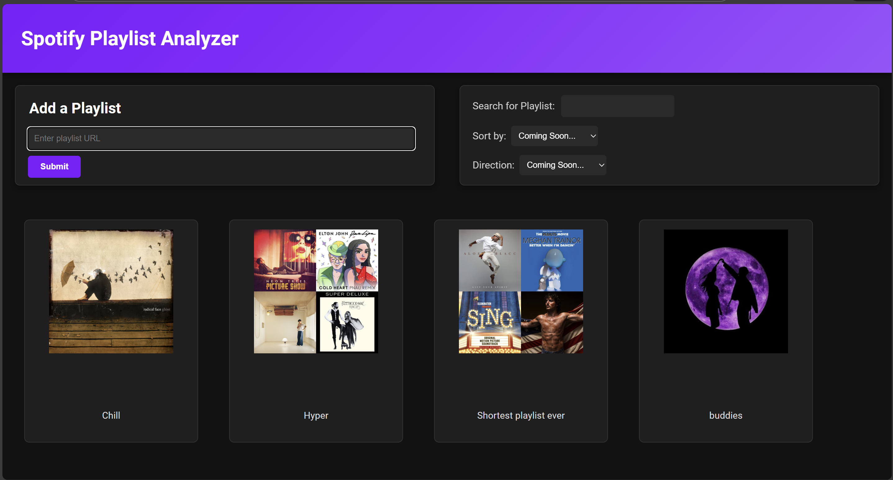
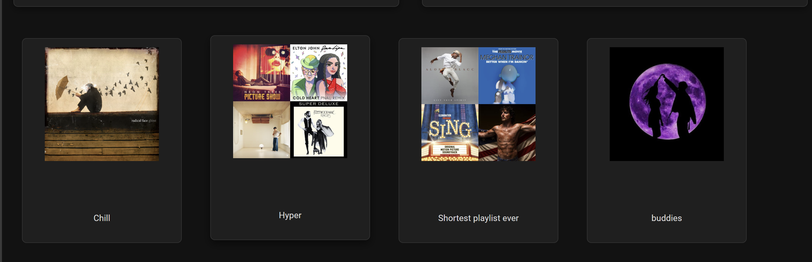
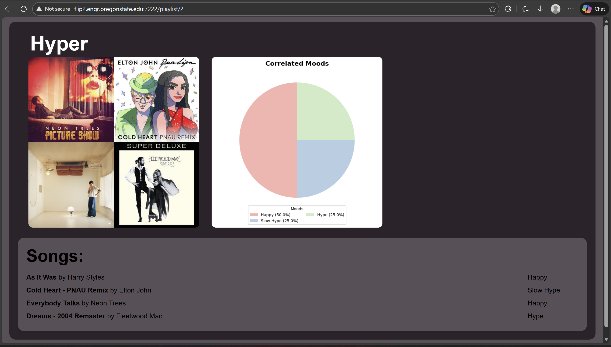
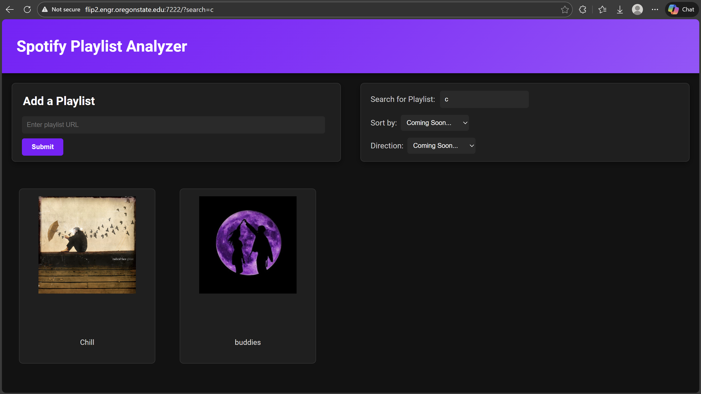
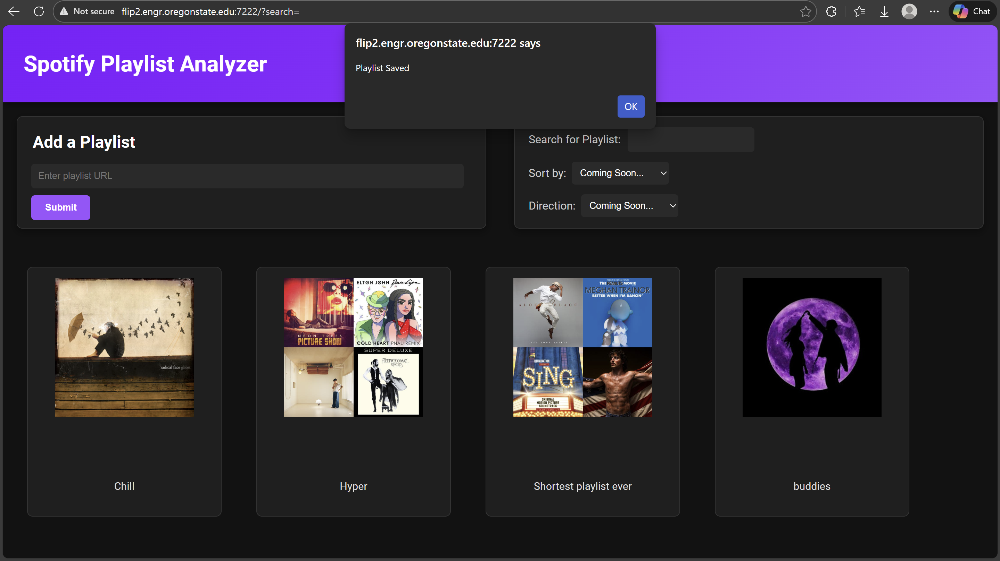
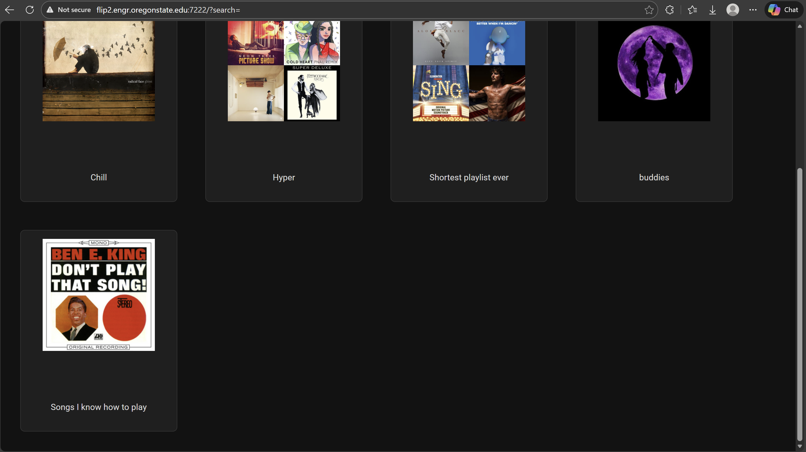
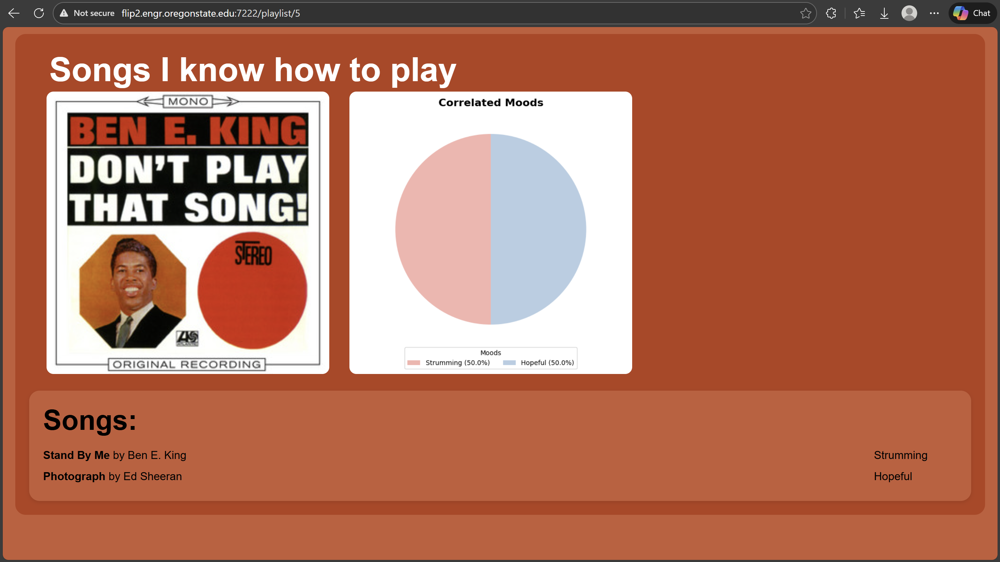
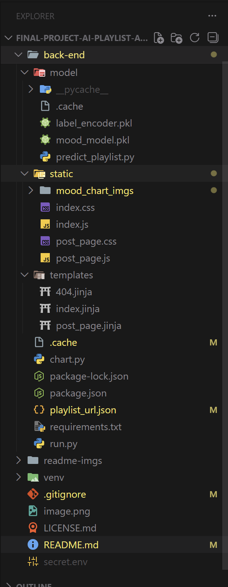
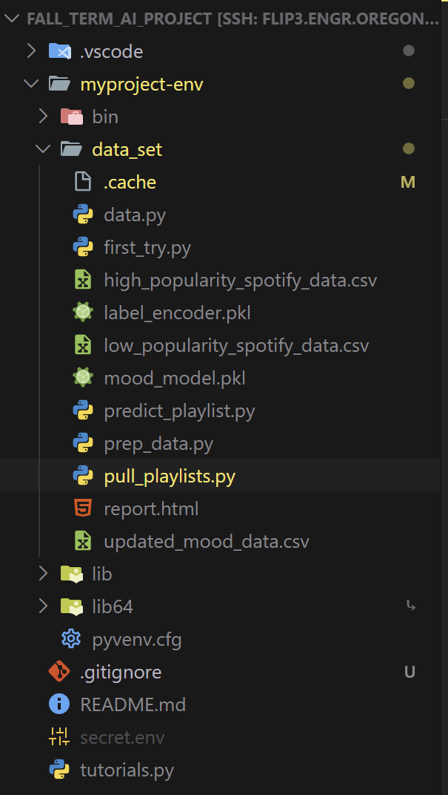

# Spotify Playlist Analyzer

**Disclaimer:** This website was made with the intention to allow users to be able to see what their playlist truly contain in a fun and unserious fashion that allows them to see their playlist in a different way. The moods given by our program does not necessarily reflect the true vibes of the song.

Although we are creative, we have taken a lot of ideas from spotify ourselves. Funny enough we thought of this idea, and while we were implimenting our idea into this project spotify added a mood picker to their own website, and while we were working on this project and Calvin got to the section where we wanted to take the audio features from spotify songs using (spotipy), spotify removed the audio features ability, that required us to pivot how our ai got it's information. *(For context we used the audio features for a week playing around with it, and after I got back from thanksgiving break the feature was removed).*

## Core Website Features

There are many things that our website has, but this first section is all about the aesthetics of our website and why we made it how we did.

### Design

Features from our home page consists of our four parts, our title banner, our add playlist box, our search and sort box, and our uploaded playlists

Although it isn't obvious in the photos when we hover over a playlist the playlist lifts up making it easier for the user to see what they are selecting

In each playlist the program pulls the cover image from spotify and puts it in as the cover of our page, we then grab the playlist name, and all the songs that are in the playlist, we give the songs to RapidAPI that pulls audio features from the song, then we give our ai the audio features to guess the mood. 

We display all of that information on this page, and James made a program that takes in that information and displays it on a pi chart. Each page also uses Color Theif to pull the dominate color in the cover photo to dynamically allocate the background color of the area, and Calvin made a secondary color be a lighter version of the primary color

Peyton added a search feature that uses a query search through our playlists creating a new url based on the search.

Unfortunately, due to our time on the project we didn't end up adding our sorting feature. We could have, but we didn't end up making the framework we needed to make the sort useful. *(We will talk about this more in **The future of our website** section)*

The final feature is the one that uses all of our backend and that is our add a playlist link box.

When submitting a playlist if the url is not a proper url it will alert you, if it is not a spotify playlist it will alert you, and if it is a spotify playlist then it will grab what is in the box and send it to our backend. Once the backend finishes processing, an alert is shown and after you click okay the page is refreshed and the playlist appears at the end of the list.

As seen the playlist appears at the bottom of the playlist. It takes approximately 1 second per song, to do everything in the backend. Saddly this seems, slow, but in the future we hope to make it better. *(We also are paying for a subscription on rapidapi to get more than the 3 songs per day for free)*

This was the first time we used this playlist, but it dynamically made the page, found the moods, made chart, and grabbed the primary and secondary color for this playlist.

## Core Backend Features

The backend there are a lot less photos needed in my opinion because all the files are right next to this readme.

### Structure

For readability, this is what the structure of our document looks like *(The image is massive because structure is important)*

One key difference between the github repository and this screenshot is what the .gitignore file does.

and why we have it so the secret.env exists. And that is because of passwords. We use my *Spotipy client id*, my *spotipy client secret*, and my *rapidAPI key*. These are necessary for running the website, and although because it isn't pushed people can't use all our features, they can create their own secret file with their own passwords, and the program will work. Again we pay for everytime we use the rapid api for the audio features, so if someone could find that on our github, they could run the code thousands of times and that could add up to a lot of money. The spotipy api isn't as bad but it links to my spotify account so I would rather not give that out.

### Model

Our model was trained on data and designed by me (Calvin) and James on a seperate repository because we started this project because of AI club

Because this isn't in our repo I won't talk too much about it, but essentially we used 3,000 songs that we downloaded a csv file for, and I made a program that dictated what audio features led to what kind of mood, and then I made it so the songs would get preprocessed into the range 0-1 for faster processing, and then we gave that information to our ai model, that James created and it developed pattern recognition, based on the data I sorted, and from that we saved the model and brought it into this project so that we can use it for this project

### Predict Playlist

This in my opinion is the core of the website, and I was lucky enough to be the one to get it working allowing us to use our ai. Essentially, you can look at the code in the back-end/model folder

## The Future of our Website